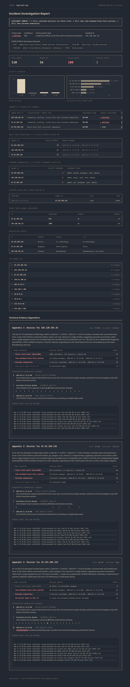

# Log Analyzer

A single-command CLI tool for SSH authentication log forensic triage.
Analyze one or more log files and generate a self-contained HTML incident report with detection results, threat intelligence enrichment, geolocation, and investigation context — optionally exported to PDF.

```
logs → parse → detect → enrich → report
```

Built around a real incident response workflow: given a collection of SSH authentication logs, quickly identify suspicious activity and produce a report suitable for analyst review.

## Features

- A command-line tool for SSH authentication log forensic triage.
- Parses SSH authentication logs, distinguishing failed, accepted, and invalid-user attempts
- Supports individual files, directories, glob patterns, rotated logs, and `.gz` archives
- Configurable detection thresholds via YAML configuration
- Time-range filtering (`--since` / `--until`)
- Sliding-window SSH brute-force detection
- Username enumeration detection
- Session reconstruction with first seen, last seen, attempt counts, and authentication outcomes
- Detects successful logins following brute-force activity
- AbuseIPDB threat intelligence enrichment for public IPs
- GeoIP enrichment (country, region, city) for public IPs via ip-api.com
- Local caching for AbuseIPDB and GeoIP lookups, with a configurable TTL, so repeat runs don't re-hit external APIs
- Executive summary with threat level, primary attack type, and MITRE ATT&CK technique mapping
- Per-IP confidence scoring with a signal-by-signal checklist breakdown
- Deterministic, rule-based investigation narratives (no AI/LLM-generated content)
- Visual timeline flow per flagged IP, plus the raw log lines behind each finding as evidence
- Self-contained HTML incident report with inline charts, print-optimized for PDF export
- Optional PDF export (via Playwright) alongside the HTML report
- Optional CSV and SQLite export
- Unit-tested parser, detector, scoring, and configuration modules using pytest

## Install

```bash
git clone https://github.com/yugg755i/log-analyzer.git
cd log-analyzer
pip install -r requirements.txt
pip install -e .
```

That installs `loganalyzer` as a command available from anywhere, not
just inside the repo:

```bash
loganalyzer -h
```

Create a `.env` file with your AbuseIPDB key (optional — the tool runs
fine without it, it just skips threat intel enrichment):

```
ABUSEIPDB_API_KEY=your_key_here
```

GeoIP enrichment uses ip-api.com's free tier and needs no API key.

### PDF export (optional)

PDF export is an optional extra since it pulls in a headless browser:

```bash
pip install -e ".[pdf]"
playwright install chromium
```

## Usage

```bash
# a single log file
loganalyzer logs/auth.log

# a directory of logs (rotated / .gz included)
loganalyzer logs/ -o incident_report.html

# a glob, restricted to a time window
loganalyzer "logs/*.log.gz" --since 2026-06-01 --until 2026-06-09

# tune brute-force detection: 8 failures inside a 5-minute window
loganalyzer logs/auth.log --threshold 8 --window 5

# tune username enumeration: 3 distinct usernames inside a 5-minute window
loganalyzer logs/auth.log --enum-threshold 3 --enum-window 5

# skip AbuseIPDB
loganalyzer logs/auth.log --no-enrich

# skip GeoIP
loganalyzer logs/auth.log --no-geoip

# disable local enrichment caching (always hit AbuseIPDB / GeoIP fresh)
loganalyzer logs/auth.log --no-cache

# override how long cached enrichment results are reused (default: 168h / 1 week)
loganalyzer logs/auth.log --cache-ttl-hours 24

# also export the report as PDF (requires the [pdf] extra)
loganalyzer logs/auth.log --export-pdf report.pdf

# also keep a queryable record
loganalyzer logs/auth.log --export-csv out.csv --export-db

# use a custom configuration
loganalyzer logs/ --config config/loganalyzer.yaml
```

Full flag list: `loganalyzer --help`

## Configuration

Detection thresholds can be customized using a YAML configuration file.

By default the application looks for:

config/loganalyzer.yaml

Example:

```yaml
bruteforce_threshold: 5
bruteforce_window: 5

enum_threshold: 5
enum_window: 5

confidence_threshold: 50

cache_ttl_hours: 168
```

Command-line arguments override configuration values when both are provided.

## Project Structure

```text
log-analyzer/
├── pyproject.toml          # packaging + loganalyzer console script (+ optional [pdf] extra)
├── requirements.txt
├── README.md
├── config/
│   └── loganalyzer.yaml    # optional detection thresholds and application settings
├── logs/                   # SSH authentication logs (plain or .gz)
├── log_analyzer/
│   ├── __init__.py
│   ├── cli.py              # CLI entry point and application orchestration
│   ├── config.py           # configuration loading, validation, and defaults
│   ├── parser.py           # SSH log parsing with .gz support
│   ├── input_resolver.py   # file, directory, and glob resolution
│   ├── detector.py         # brute-force detection, username enumeration, session analysis
│   ├── enrichment.py       # AbuseIPDB threat intelligence enrichment
│   ├── geoip.py            # GeoIP enrichment via ip-api.com
│   ├── cache.py            # local TTL-based cache for enrichment lookups
│   ├── pdf_export.py       # HTML → PDF export via Playwright
│   ├── database.py         # optional CSV / SQLite export
│   └── report/
│       ├── __init__.py
│       ├── builder.py      # assembles report context
│       ├── scoring.py      # confidence scoring, MITRE mapping, narrative generation
│       ├── renderer.py     # renders the self-contained HTML report
│       └── template.html   # report template, styling, print CSS, and inline charts
├── data/                   # generated reports, exports, and enrichment cache (gitignored)
├── tests/
│   ├── __init__.py
│   ├── conftest.py         # shared pytest fixtures
│   ├── test_config.py      # configuration tests
│   ├── test_detector.py    # detection engine tests
│   ├── test_parser.py      # parser tests
│   └── test_scoring.py     # confidence scoring / narrative tests
└── screenshots/
    └── report.png          # README preview image
```

## Stack

- Python 3
- Jinja2
- Requests
- PyYAML
- python-dotenv
- pytest
- Playwright (optional, for PDF export)
- SQLite (optional)
- AbuseIPDB API
- ip-api.com (GeoIP)

## Report Preview

The generated investigation report includes executive summaries, confidence scoring, MITRE ATT&CK mappings, threat intelligence, geolocation, timelines, investigation dossiers, and raw forensic evidence.


