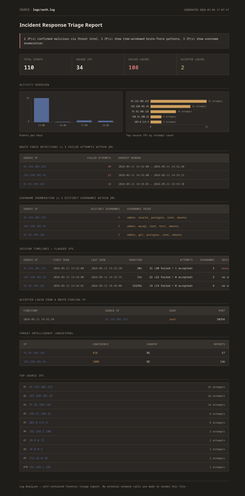

# Log Analyzer

A single-command CLI tool for SSH auth log forensic triage. Point it at
one or more logs, get a self-contained HTML report back.

```
logs in -> parse -> detect -> enrich -> one HTML report out
```

Built for the workflow an analyst actually has during incident
response — you're handed a log dump, not asked to spin up a web app.

## Features

- Single-command CLI, installed as a real `loganalyzer` command — no `python script.py`
- Parses SSH auth logs, distinguishing failed / accepted / invalid-user attempts
- Accepts a single file, a directory, or a glob — including `.gz` / rotated logs
- Time-range filtering (`--since` / `--until`)
- **Time-windowed brute-force detection** — flags IPs with N+ failed attempts inside a sliding window, not a flat count over the whole file
- **Username enumeration detection** — flags IPs trying many distinct usernames in a short window
- **Session timelines** — first seen, last seen, attempt breakdown, and outcome for every flagged IP
- Flags the highest-signal case: an accepted login from an IP that also brute-forced
- AbuseIPDB threat intelligence enrichment for public IPs
- Self-contained HTML report — inline charts, no CDN, no external calls to render it
- Optional CSV / SQLite export for anyone who wants a queryable record

## Install

```bash
git clone https://github.com/yugg755i/log-analyzer.git
cd log-analyzer
pip install -e .
```

That installs `loganalyzer` as a command available from anywhere, not
just inside the repo:

```bash
loganalyzer -h
```

Create a `.env` file with your AbuseIPDB key (optional — the tool runs
fine without it, it just skips threat intel enrichment):

```
ABUSEIPDB_API_KEY=your_key_here
```

## Usage

```bash
# a single log file
loganalyzer logs/auth.log

# a directory of logs (rotated / .gz included)
loganalyzer logs/ -o incident_report.html

# a glob, restricted to a time window
loganalyzer "logs/*.log.gz" --since 2026-06-01 --until 2026-06-09

# tune brute-force detection: 8 failures inside a 5-minute window
loganalyzer logs/auth.log --threshold 8 --window 5

# tune username enumeration: 3 distinct usernames inside a 5-minute window
loganalyzer logs/auth.log --enum-threshold 3 --enum-window 5

# skip AbuseIPDB
loganalyzer logs/auth.log --no-enrich

# also keep a queryable record
loganalyzer logs/auth.log --export-csv out.csv --export-db
```

Full flag list: `loganalyzer --help`

## Project Structure

```text
log-analyzer/
├── pyproject.toml          # packaging + the loganalyzer console-script entry point
├── requirements.txt
├── README.md
├── logs/                   # drop SSH auth logs here (plain or .gz)
├── log_analyzer/
│   ├── cli.py              # CLI entrypoint — argument parsing, orchestrates the run
│   ├── parser.py           # log parsing, status/invalid-user aware, gz support
│   ├── input_resolver.py   # file / directory / glob resolution
│   ├── detector.py         # time-windowed brute-force, username enumeration, sessions
│   ├── enrichment.py       # AbuseIPDB threat intelligence
│   ├── database.py         # optional CSV / SQLite export
│   └── report/
│       ├── builder.py      # assembles report context
│       ├── renderer.py     # renders the self-contained HTML file
│       └── template.html   # report layout, styling, inline charts
├── data/                   # generated reports / exports (gitignored)
└── tests/
```

## Stack

- Python 3
- Jinja2 (report templating)
- Requests
- python-dotenv
- SQLite (optional export only)
- AbuseIPDB API

## Report Preview


