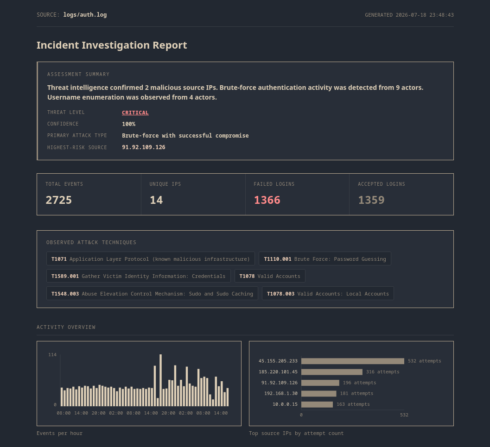
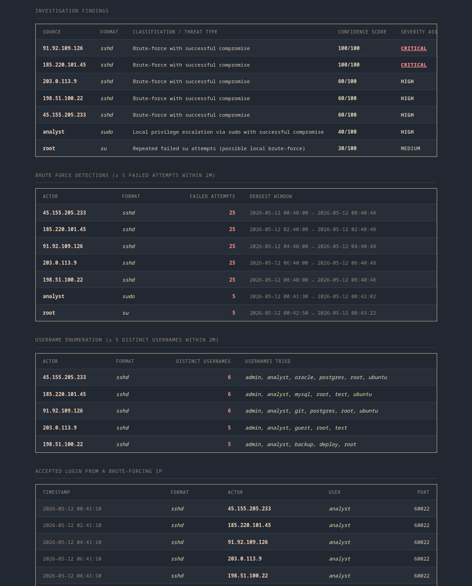
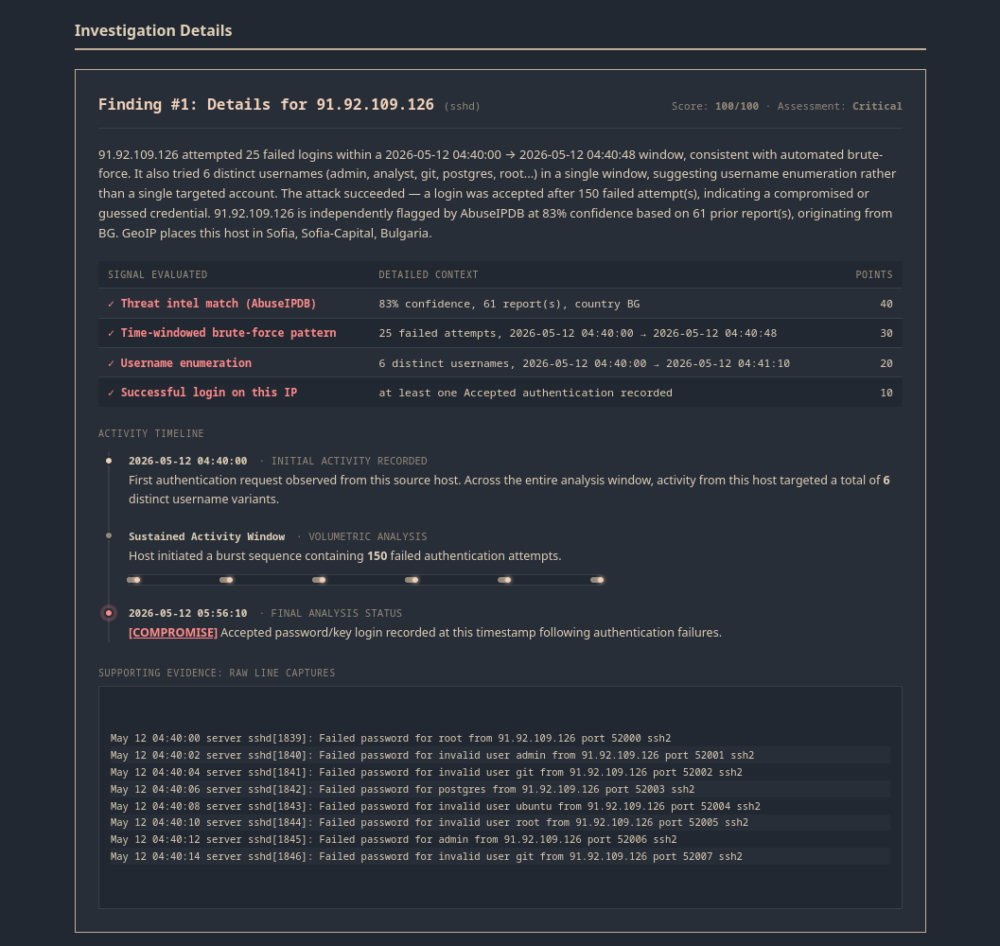
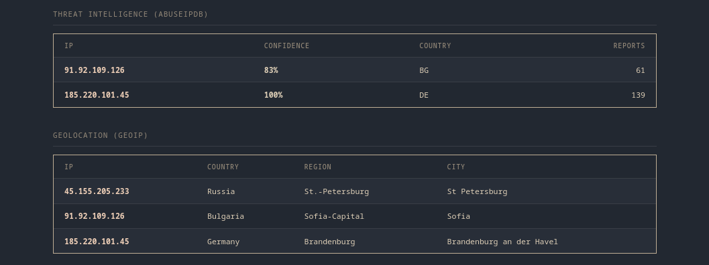

# auth-log-analyzer

A single-command CLI tool for Linux authentication log forensic triage.
Analyze one or more Linux authentication logs and generate an HTML incident investigation report featuring detection results, threat intelligence enrichment, geolocation, confidence scoring, and supporting forensic evidence.

```
logs → parse → detect → enrich → report
```

Generate a complete investigation report with a single command:


Supports SSH (`sshd`), `sudo`, and `su` authentication logs with automatic format detection.
Built around a real incident response workflow: given a collection of authentication logs, quickly identify suspicious activity and produce a report suitable for analyst review.

## Supported log types

| Log type | Source | Actor | Notes |
|---|---|---|---|
| `sshd` | SSH daemon auth log | source IP | brute-force, username enumeration, breach detection |
| `sudo` | `sudo` PAM auth failures + command execution | invoking username | reliable actor identity — sudo authenticates the caller's own password |
| `su` | `su` PAM auth failures + successful switches | username | **failures only identify the target account**, not the caller — see caveat below |

Log type is auto-detected per line from the syslog program tag (`sshd[pid]:`, `sudo:`, `su[pid]:`), so a single mixed `auth.log` containing all three works without any flag. Lines from anything else (`cron`, `systemd-logind`, etc.) are skipped. Use `--log-type sshd|sudo|su` to force one format if you need to disambiguate an unusual log or feed it a non-standard file.

**Caveat on `su` failures:** a failed `su` attempt's PAM line reliably logs the *target* account (`user=root`) but the real caller (`ruser=`) is frequently blank on default PAM configs — that's a property of the log format, not a gap in this tool. In practice this means a flagged `su` actor tells you "repeated attempts to escalate to this account," not "who's doing it." `sudo` doesn't have this problem — its failure line authenticates the caller's own password, so the invoking username is always the reliable actor.

## Features

- A command-line tool for authentication log forensic triage across `sshd`, `sudo`, and `su`
- Parses mixed-format logs, auto-detecting the source program per line (or force one with `--log-type`)
- Distinguishes failed, accepted, and invalid-user attempts
- Supports individual files, directories, glob patterns, rotated logs, and `.gz` archives
- Configurable detection thresholds via YAML configuration
- Time-range filtering (`--since` / `--until`)
- Sliding-window brute-force detection, grouped by IP for `sshd` and by username for `sudo`/`su`
- Username enumeration detection (sshd; structurally inert for sudo/su, where the actor and the username are the same field)
- Session reconstruction with first seen, last seen, attempt counts, and authentication outcomes
- Detects successful logins/privilege escalations following brute-force activity
- AbuseIPDB threat intelligence enrichment for public IPs
- GeoIP enrichment (country, region, city) for public IPs via ip-api.com
- Local caching for AbuseIPDB and GeoIP lookups, with a configurable TTL, so repeat runs don't re-hit external APIs
- Assessment summary with threat level, confidence scoring, primary attack type, and MITRE ATT&CK technique mapping
- Per-actor confidence scoring with a signal-by-signal checklist breakdown
- Deterministic, rule-based investigation narratives (no AI/LLM-generated content), with wording that adapts to log type (logins vs. sudo authentication attempts vs. su attempts)
- Visual timeline flow per flagged actor, plus the raw log lines behind each finding as evidence
- Self-contained HTML incident report with inline charts, print-optimized for PDF export
- Optional PDF export (via Playwright) alongside the HTML report
- Optional CSV and SQLite export
- Unit-tested parser, detector, scoring, and configuration modules using pytest

## Report Preview

### Assessment Summary



### Investigation Findings



### Investigation Details



### Threat Intelligence & Geolocation



## Install

```bash
git clone https://github.com/yugg755i/auth-log-analyzer.git
cd auth-log-analyzer
pip install -r requirements.txt
pip install -e .
```

That installs `loganalyzer` as a command available from anywhere, not
just inside the repo:

```bash
loganalyzer -h
```

Create a `.env` file with your AbuseIPDB key (optional — the tool runs
fine without it, it just skips threat intel enrichment):

```
ABUSEIPDB_API_KEY=your_key_here
```

### PDF export (optional)

PDF export is an optional extra since it pulls in a headless browser:

```bash
pip install -e ".[pdf]"
playwright install chromium
```

## Usage

```bash
# a single log file (auto-detects sshd/sudo/su per line)
loganalyzer logs/auth.log

# a directory of logs (rotated / .gz included)
loganalyzer logs/ -o incident_report.html

# a glob, restricted to a time window
loganalyzer "logs/*.log.gz" --since 2026-06-01 --until 2026-06-09

# force a single format instead of auto-detecting (e.g. a non-standard log)
loganalyzer sudo_only.log --log-type sudo

# tune brute-force detection: 8 failures inside a 5-minute window
loganalyzer logs/auth.log --threshold 8 --window 5

# tune username enumeration: 3 distinct usernames inside a 5-minute window
loganalyzer logs/auth.log --enum-threshold 3 --enum-window 5

# skip AbuseIPDB
loganalyzer logs/auth.log --no-enrich

# skip GeoIP
loganalyzer logs/auth.log --no-geoip

# disable local enrichment caching (always hit AbuseIPDB / GeoIP fresh)
loganalyzer logs/auth.log --no-cache

# override how long cached enrichment results are reused (default: 168h / 1 week)
loganalyzer logs/auth.log --cache-ttl-hours 24

# also export the report as PDF (requires the [pdf] extra)
loganalyzer logs/auth.log --export-pdf report.pdf

# also keep a queryable record
loganalyzer logs/auth.log --export-csv out.csv --export-db

# use a custom configuration
loganalyzer logs/ --config config/loganalyzer.yaml
```

See all available options:

```bash
loganalyzer --help
```

## Configuration

Detection thresholds can be customized using a YAML configuration file.

By default the application looks for:

```text
config/loganalyzer.yaml
```

Example:

```yaml
bruteforce_threshold: 5
bruteforce_window: 5

enum_threshold: 5
enum_window: 5

confidence_threshold: 50

cache_ttl_hours: 168
```

Command-line arguments override configuration values when both are provided.

## Project Structure

```text
auth-log-analyzer/
├── pyproject.toml          # packaging + loganalyzer console script (+ optional [pdf] extra)
├── requirements.txt
├── README.md
├── config/
│   └── loganalyzer.yaml    # optional detection thresholds and application settings
├── logs/                   # authentication logs (plain or .gz)
├── log_analyzer/
│   ├── __init__.py
│   ├── cli.py              # CLI entry point and application orchestration
│   ├── config.py           # configuration loading, validation, and defaults
│   ├── parser.py           # sshd/sudo/su log parsing with format auto-detection and .gz support
│   ├── input_resolver.py   # file, directory, and glob resolution
│   ├── detector.py         # brute-force detection, username enumeration, session analysis (actor-based)
│   ├── enrichment.py       # AbuseIPDB threat intelligence enrichment
│   ├── geoip.py            # GeoIP enrichment via ip-api.com
│   ├── cache.py            # local TTL-based cache for enrichment lookups
│   ├── pdf_export.py       # HTML → PDF export via Playwright
│   ├── database.py         # optional CSV / SQLite export
│   └── report/
│       ├── __init__.py
│       ├── builder.py      # partitions events by log type, assembles report context
│       ├── scoring.py      # confidence scoring, per-log-type MITRE mapping, narrative generation
│       ├── renderer.py     # renders the HTML report
│       └── template.html   # report template, styling, print CSS, and inline charts
├── data/                   # generated reports, exports, and enrichment cache (gitignored)
├── tests/
│   ├── __init__.py
│   ├── conftest.py         # shared pytest fixtures
│   ├── test_config.py      # configuration tests
│   ├── test_detector.py    # detection engine tests
│   ├── test_parser.py      # sshd parser tests
│   ├── test_parser_multi.py # sudo/su parser tests, mixed-log-type isolation
│   └── test_scoring.py     # confidence scoring / narrative tests
└── screenshots/
    ├── cli-demo.gif
    ├── executive_summary.png
    ├── detection_findings.png
    ├── investigation_details.png
    └── enrichment.png
```
## Stack

- Python 3
- Jinja2
- Requests
- PyYAML
- python-dotenv
- pytest
- Playwright (optional, for PDF export)
- SQLite (optional)
- AbuseIPDB API
- ip-api.com (GeoIP)
