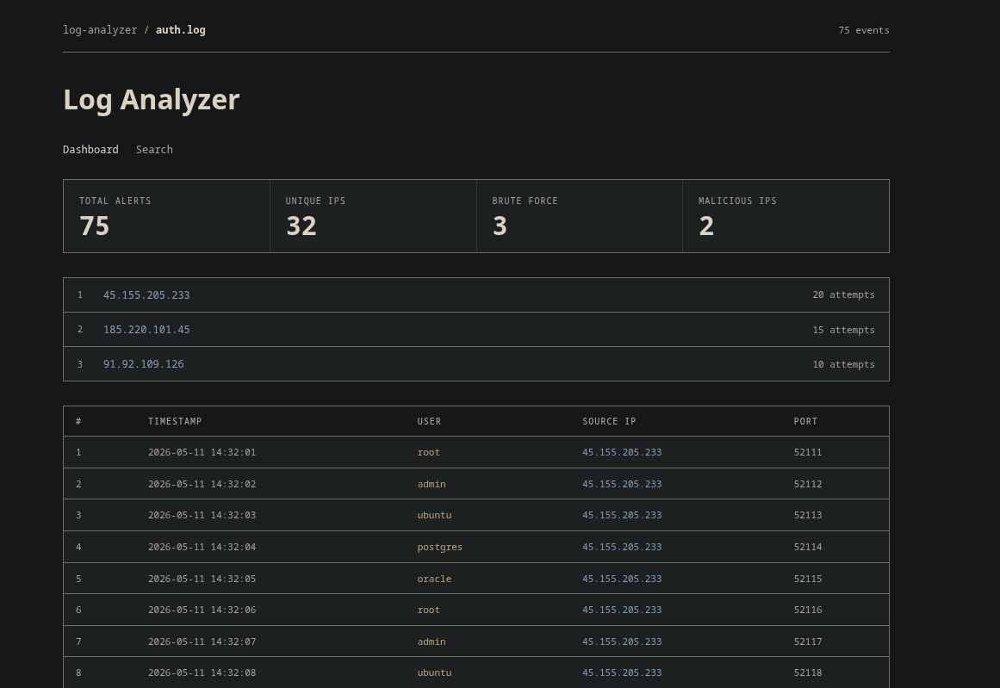
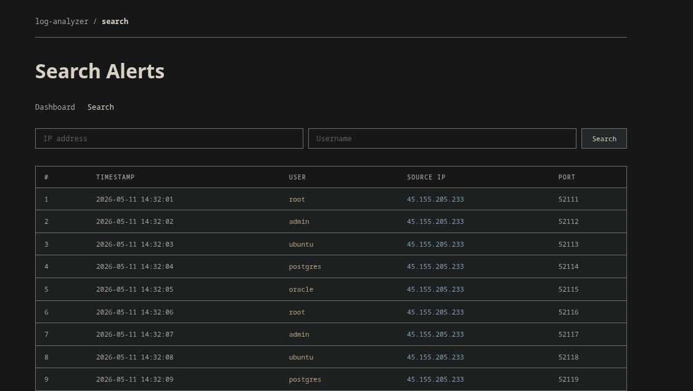
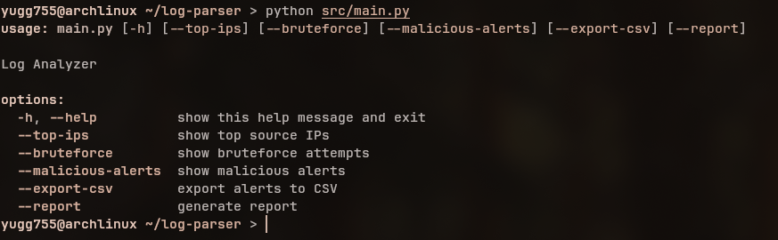

# Log Analyzer

A Python-based SOC log analysis tool that parses SSH authentication logs, detects brute-force activity, enriches public IPs using AbuseIPDB, and presents findings through both a CLI and Flask dashboard.

Built as a portfolio project to practice log parsing, detection engineering, and threat intelligence workflows in a realistic SOC context.

## Features

- SSH authentication log parsing
- Brute-force detection
- AbuseIPDB threat intelligence enrichment
- SQLite alert storage
- CSV and JSON export
- Text-based investigation reports
- Flask dashboard
- Search by IP and username

## Screenshots

### Dashboard



### Search Interface



### CLI Usage



## Setup

```bash
git clone https://github.com/yugg755i/log-analyzer.git
cd log-analyzer
pip install -r requirements.txt
```

Create a `.env` file with your AbuseIPDB key:

```
ABUSEIPDB_API_KEY=your_key_here
```

Place SSH auth logs (`.log` files) in the `logs/` directory.

## Project Structure

```text
log-analyzer/
├── app.py              # Flask dashboard entry point
├── requirements.txt
├── README.md
├── config/
├── logs/
│   └── auth.log        # sample SSH authentication log
├── src/
│   ├── __init__.py
│   ├── parser.py       # log parsing and timestamp normalization
│   ├── detector.py     # brute-force detection and IP analysis
│   ├── enrichment.py   # AbuseIPDB threat intelligence enrichment
│   ├── reporter.py     # report generation and JSON export
│   ├── database.py     # SQLite storage, search, and CSV export
│   ├── pipeline.py     # log processing workflow
│   ├── utils.py        # log file discovery utilities
│   └── main.py         # CLI entry point
├── templates/
│   ├── dashboard.html  # dashboard page
│   └── search.html     # search page
├── static/
│   └── style.css       # dashboard styling
├── screenshots/        # README screenshots
├── data/               # generated output files
└── tests/
```

## CLI usage

```bash
# Show top attacking IPs
python src/main.py --top-ips

# Detect brute-force activity
python src/main.py --bruteforce

# Check IPs against AbuseIPDB and show malicious alerts
python src/main.py --malicious-alerts

# Export alerts to CSV
python src/main.py --export-csv

# Generate full investigation report
python src/main.py --report
```

## Dashboard

```bash
python app.py
```

Opens at `http://localhost:5000`. Shows live alert stats, top source IPs with attempt bars, the full alert log, and an IP/username search page.

## Stack

- Python 3
- Flask
- SQLite
- Requests
- python-dotenv
- AbuseIPDB API

## Sample output

```
LOG ANALYZER REPORT
Generated: 2026-06-09 15:34:07

SUMMARY
-------
Total Alerts Parsed: 75
Unique Source IPs: 32
Potential Brute Force Sources: 3
Malicious IPs Identified: 2

TOP SOURCE IPS
--------------
45.155.205.233 : 20 attempts
185.220.101.45 : 15 attempts
91.92.109.126 : 10 attempts
```
